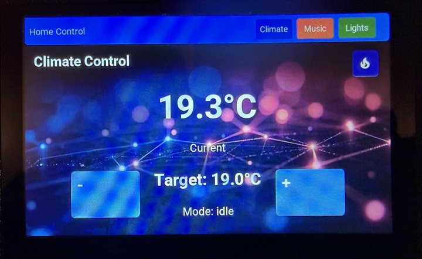
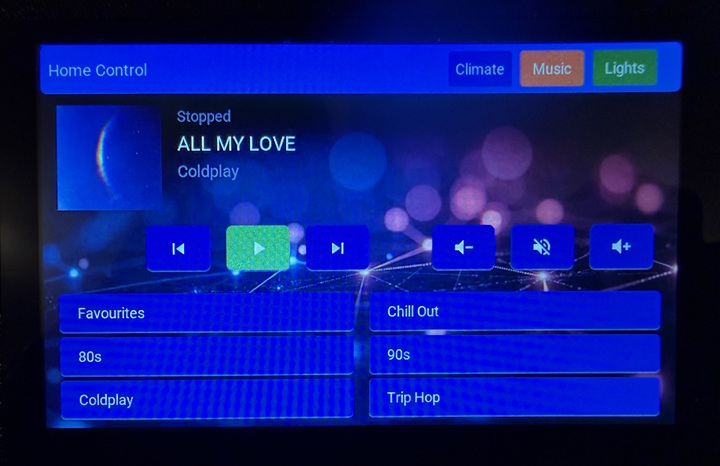
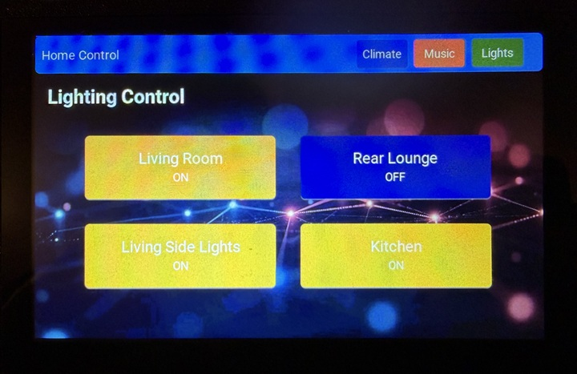
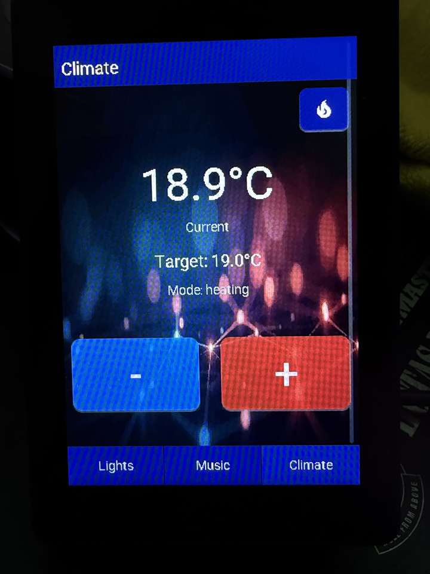
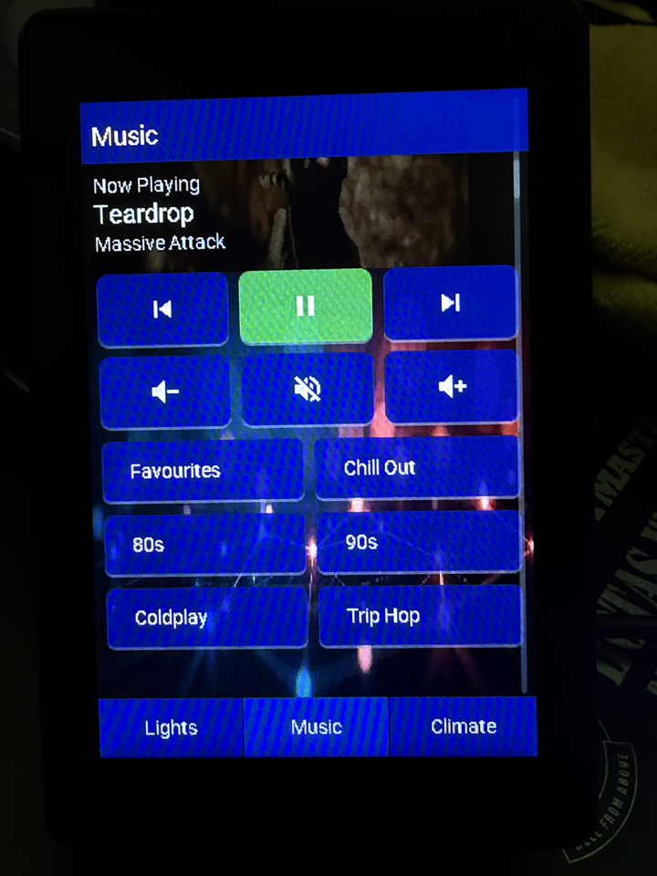
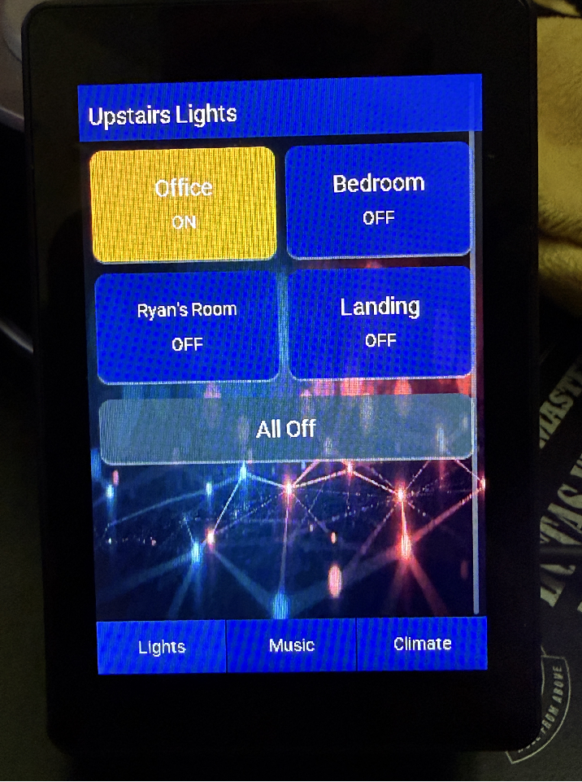
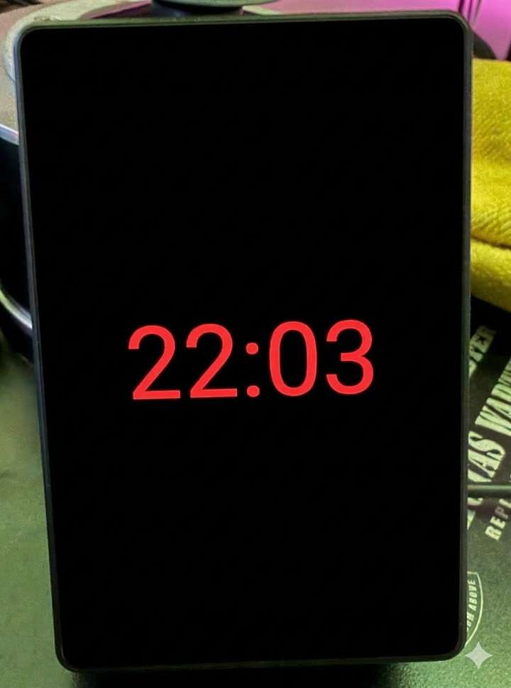

# ESPHome Home Control Panels

ESPHome configurations for ESP32-S3 touchscreen displays running a Home Assistant control panel with **climate**, **music** (Spotify), **radio** (HLS streams), and **lighting** pages — plus screensaver and auto-sleep.

> **Setting up Home Assistant?** See **[HOME_ASSISTANT_SETUP.md](HOME_ASSISTANT_SETUP.md)** for the full HA-side configuration: required entities, the `input_select` helpers / template sensors / scripts that drive the dynamic playlist & radio browsers, Spotify integration notes, and a troubleshooting table.

## Features

- **Climate Control** — current & target temperature, +/- adjustment, boost toggle
- **Music Player** — play/pause, skip, volume, mute, album art, dynamic playlist browser
- **Radio** *(CrowPanel only)* — dynamic browser for HLS / streaming radio stations (e.g. BBC) on Sonos
- **Lighting** — 4 togglable light buttons with live on/off state
- **Dynamic browsers** *(CrowPanel only)* — playlist and radio slots are populated from HA `input_select` helpers, so you can reorder/rename/replace entries without reflashing
- **Screensaver** — large clock on black background after configurable idle timeout
- **Auto-sleep** — backlight turns off after extended idle period
- **Custom background** — loads a JPEG from your Home Assistant `www/` folder at boot

## Configurations

This repo contains two configurations for different hardware:

### 1. [Elecrow CrowPanel 5.0"](https://www.aliexpress.com/item/1005006001402750.html) (`Crowpanel_esp32_5_inch.yaml`)

| | |
|---|---|
| **Display** | 5.0" 800×480 RGB parallel TFT |
| **MCU** | ESP32-S3-WROOM-1-N4R8 |
| **Touch** | GT911 capacitive (I2C) |
| **Orientation** | Landscape |
| **Media Player** | Standard HA `media_player` service calls |
| **Background Size** | 800×480 |
| **Album Art Size** | 130×130 |







### 2. [Guition JC3248W535 3.5"](https://www.aliexpress.com/item/1005010587834753.html) (`Guition_JC3248W535_3.5_inch_ESP32.yaml`)

| | |
|---|---|
| **Display** | 3.5" 320×480 QSPI TFT (AXS15231) |
| **MCU** | ESP32-S3 (16 MB flash) |
| **Touch** | AXS15231 capacitive (I2C) |
| **Orientation** | Portrait |
| **Media Player** | SpotifyPlus custom integration (`spotifyplus.player_media_play_context`) |
| **Background Size** | 320×480 |
| **Album Art Size** | 320×320 (used as music page background) |









### Key Differences

| | CrowPanel 5" | Guition JC3248W535 3.5" |
|---|---|---|
| Resolution | 800×480 landscape | 320×480 portrait |
| Display interface | RGB parallel (`rpi_dpi_rgb`) | QSPI (`qspi_dbi`) |
| Touchscreen driver | GT911 | AXS15231 |
| Music integration | Standard HA `media_player` | SpotifyPlus (requires HACS integration) |
| Album art | Small thumbnail beside track info | Full-width background on music page |

## Prerequisites

- [ESPHome](https://esphome.io/) (2024.x or later recommended)
- [Home Assistant](https://www.home-assistant.io/) with API access
- Fonts in a `fonts/` folder alongside the YAML:
  - `Roboto-Regular.ttf`
  - `Roboto-Bold.ttf`
- A `background.jpg` placed in your Home Assistant `www/` folder (resized to match your display)
- **Guition config only:** [SpotifyPlus](https://github.com/thlucas1/homeassistantcomponent_spotifyplus) HACS integration

## Quick Start

1. Copy the appropriate YAML file into your ESPHome config directory.
2. Download the [Roboto font files](https://fonts.google.com/specimen/Roboto) and place them in a `fonts/` folder next to the YAML.
3. Place a `background.jpg` (resized to your display resolution) in your HA `config/www/` folder.
4. Create a `secrets.yaml` with the required secrets:
   ```yaml
   wifi_ssid: "YourSSID"
   wifi_password: "YourPassword"
   api_encryption_key: "your-api-encryption-key"
   ota_password: "your-ota-password"
   fallback_ap_password: "your-fallback-password"
   ```
5. Edit the `substitutions` block at the top of the YAML to match your Home Assistant entity IDs, Spotify playlist URIs, and preferences.
6. Configure the Home Assistant side — entities, helpers, scripts, and (for the CrowPanel) the dynamic playlist/radio browsers. See **[HOME_ASSISTANT_SETUP.md](HOME_ASSISTANT_SETUP.md)** for step-by-step instructions.
7. Flash via ESPHome Dashboard or CLI:
   ```bash
   esphome run Crowpanel_esp32_5_inch.yaml
   ```

## Customisation

All user-specific settings are in the `substitutions` block at the top of each YAML file:

- **Entity IDs** — climate, media player, and light entities
- **Playlist URIs** — 6 Spotify playlist/album URIs with custom labels
- **Timings** — screensaver timeout, display-off timeout, screensaver brightness
- **URLs** — HA base URL, background image URL

No changes to the rest of the file should be needed for basic use.

## License

This project is provided as-is for personal/home use.
